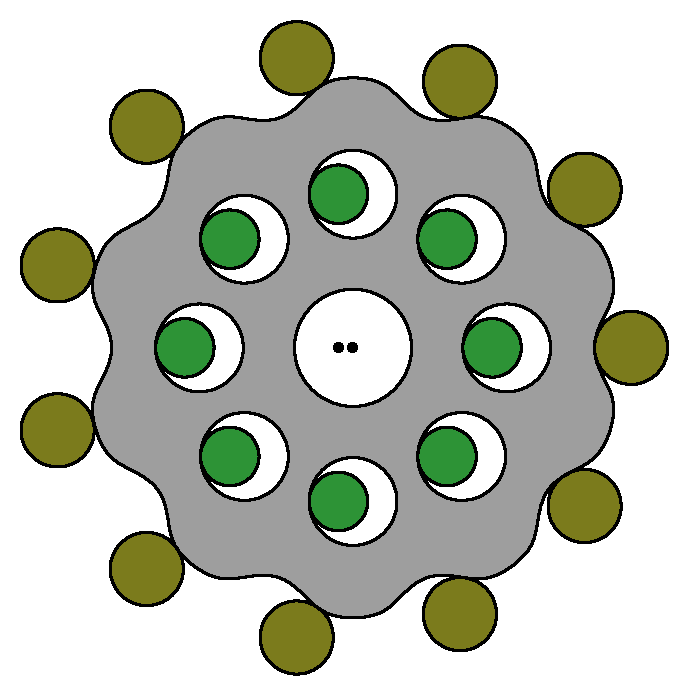

# Fusion360 script for creating Cycloidal Drive sketch
this can create part of cycloidal drive
* Cycloida gear (gray)
    * Trochoidal parallel curve
    * Centor hole
    * Cround hole
* Ring pin (green)
* Output disk pin (yellow)

## Necessary parameter
you need least 5 parameter

#### Raducation ratio
raducation ratio = 1 - (ring pin num / cycloidal gear thooth num)  
This script support only max raducation ratio.  
So, ring pin num = cycloidal gear thooth num + 1

####  Eccentric amount
Eccentric amount is difference between centor of ring pin pitch ring and centor of cycloidal gear.  

####  Ring pin diameter
diameter

####  Ring pin pitch diameter
Pitch ring is through to the all centor of ring pin.  

####  Cycroidal curve plot num par thooth
This script reder curve in sprine command.  
So, you need to decide point num.  
if few point num, cycroidal curve be inexactitude.  
if a lot of point num, run slow.  

## Optionary parameter
if you want to draw more, you can draw centor hole, around hole and output disk pin.  

#### Draw cycroidal gear centor hole (Cycroidal gear centor hole)
if you check this, drawn centor hole and you can set diameter.  

#### Diameter (Cycroidal gear centor hole)
centor hole diameter

#### Draw cycloidal gear around hole (Cycroidal gear to output disk)
if you check this, drawn around hole and you can set parameter.  

#### Draw output disk pin (Cycroidal gear to output disk)
if you check this, drawn output disk pin and you can set parameter.  

#### Set about (Cycroidal gear to output disk)
around hole parameter linked with output disk parameter.  
you can choise set about around hole's parameter or output disk pin's parameter.

#### Hole(pin) num
around hole or disk pin num.    

#### Hole(pin) diameter
around hole or disk pin diameter
around hole diameter - output disk pin diameter = 2 *  Eccentric amount

#### Centor to hole(pin) distance
centor of cycloidal gear to around hole distance.  
Or centor of output disk to output disk pin distance.  

## detail setting
you choise separate or combine.  

#### sketch (Separate)
if you check this, create 3 sketch(cycloidal gear, ring pins, output disk).  
else, create 1 sketch.  

#### component (Separate)
if you check this, create 3 component and create sketch in each component.  
else, create sketch in active component.  